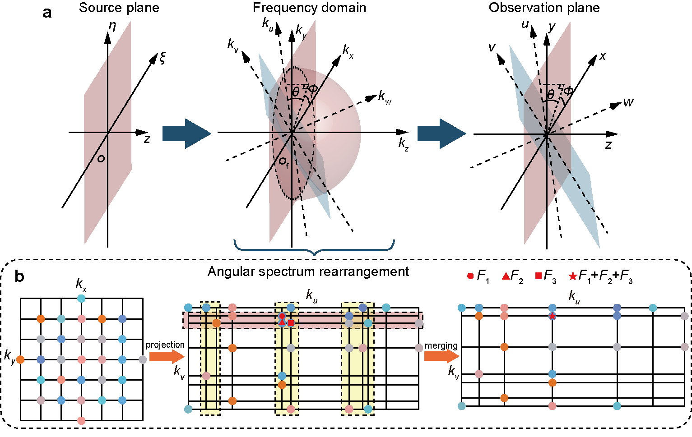

# Angular Spectrum Rearrangement
This repository provides the official open-source code of the following paper:

**[Diffraction modeling between arbitrary non-parallel planes using angular spectrum rearrangement](https://opg.optica.org/optica/abstract.cfm?doi=10.1364/OPTICA.544604), Optica, 2024**\
Yiwen Hu<sup>\*</sup>, Xin Liu<sup>\*\,✉</sup>, Xu Liu, and Xiang Hao<sup>✉</sup>\
<sup>\*</sup>Equal contributors\
<sup>✉</sup>Correspondence: Prof. Hao (www.haoxiang.ac.cn) and Dr. Liu (https://liux2018.github.io).  
For implementation and simulation details, please contact Yiwen (huyw@zju.edu.cn).

<p align="center">
    
</p>

## Quick start

This repository contains demonstrations of scalar and vectorial diffraction modeling between two arbitrary planes using the proposed angular spectrum rearrangement. It also includes the comparison of our method with the control algorithm that combines the chirp Z-transform and angular spectrum interpolation, where the naive point-by-point integration serves as the ground truth.

### Config and Run
Just run the following main scripts:
```
ScalarDiffraction_test.m
VectorialDiffraction_test.m
```

## Citation

If you use this code and find our work valuable, please cite our paper.
```
@article{Hu2024DiffractionModelingBetween,
  title={Diffraction modeling between arbitrary planes using angular spectrum rearrangement},
  author={Hu, Yiwen and Liu, Xin and Liu, Xu and Hao, Xiang},
  year={2024},
  journal={Optica},
  volume = {12},
  number = {1},
  pages = {39--45},
  doi={10.1364/OPTICA.544604},
}
```

## License

<a rel="license" href="http://creativecommons.org/licenses/by-nc/4.0/"></a><br />This work is licensed under a <a rel="license" href="http://creativecommons.org/licenses/by-nc/4.0/">Creative Commons Attribution-NonCommercial 4.0 International License</a>.
